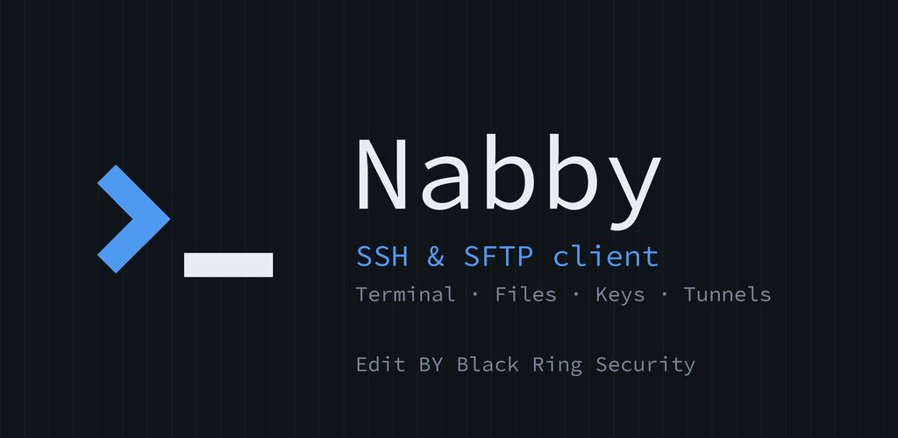

<p align="center">
  
</p>

<p align="center">
  <b>Free, open source SSH terminal and SFTP file manager for Android.</b><br>
  Inspired by the <a href="https://tabby.sh">Tabby</a> desktop terminal · Edit BY Black Ring Security
</p>

<p align="center">
  <a href="https://github.com/Black-Ring-Security/nabby/actions/workflows/ci.yml"></a>
  <a href="https://github.com/Black-Ring-Security/nabby/releases/latest"></a>
  <a href="LICENSE"></a>
</p>

## Download

- **Google Play**: https://play.google.com/store/apps/details?id=com.blackringsecurity.nabby
- **APK**: [latest GitHub release](https://github.com/Black-Ring-Security/nabby/releases/latest)
- **Website**: https://black-ring-security.github.io/nabby/
- **Privacy policy**: https://black-ring-security.github.io/nabby/privacy.html

## Features

**Terminal**: xterm-256color, multiple tabs (drag to reorder), title from the remote shell,
pinch to zoom, copy/paste, multi-line paste warning, startup commands.
Extra keys bar: ESC, TAB, sticky CTRL/ALT, arrows (hold to repeat), HOME/END, PGUP/PGDN,
^C ^D ^Z ^L ^R, F1-F12.

**Authentication**: password, private keys (Ed25519 / RSA / ECDSA, OpenSSH or PEM,
encrypted or not), keyboard-interactive (2FA / OTP). Generate Ed25519 keys on the phone.

**Security**: passwords and keys encrypted with the Android Keystore. Host key verification
with known hosts and a clear warning when a server key changes. No analytics, no network
traffic except to your own servers.

**SFTP**: browse, upload, download/save, open with/share, built-in text editor,
rename/move, chmod, new file/folder, recursive delete, hidden files, sorting.

**Networking**: jump hosts (ProxyJump chains), local / remote / dynamic SOCKS5 port
forwarding, keepalive, stays connected in the background with a "Disconnect all"
notification and alerts when a session drops.

**Look**: all 192 Tabby color schemes, per-host schemes, dark/light/system theme,
accent colors, font size, cursor style.

**Hosts**: groups, favorites, recent, color tags, quick connect (`user@host:port`),
import from Tabby desktop (`~/.config/tabby/config.yaml`), JSON backup/restore.

## Build from source

Requirements: Flutter 3.44+ (stable), JDK 17+, Android SDK.

```bash
git clone https://github.com/Black-Ring-Security/nabby.git
cd nabby
flutter pub get
flutter run                          # debug build on a connected device
flutter build apk --release          # build/app/outputs/flutter-apk/app-release.apk
flutter build appbundle --release    # build/app/outputs/bundle/release/app-release.aab
```

Without `android/key.properties`, release builds are signed with the debug key,
which is fine for local testing.

### Android Studio

Install the **Flutter** and **Dart** plugins, open the project root folder (not `android/`),
then **Build → Flutter → Build App Bundle**.

## Tests

```bash
flutter analyze
flutter test
```

`test/ssh_integration_test.dart` runs end-to-end against a real `sshd`
(terminal, keys, jump hosts, port forwarding, SFTP). See the comment at the top of
the file for how to point it at a test server; it is skipped otherwise.

## Project layout

```
lib/
  models/        host profiles, port forwards, stored keys
  services/      SSH connection, terminal sessions, storage, themes, updates
  ui/            screens: hosts, terminal, SFTP, keys, settings
android/         Kotlin foreground service + notifications
assets/          color schemes, font, third-party licenses
fastlane/        Google Play / F-Droid store listing (en-US, ar)
docs/            website and privacy policy (GitHub Pages)
tool/            asset generators, CI secrets helper
```

## Releasing

See [PUBLISHING.md](PUBLISHING.md). Short version: bump `version:` in `pubspec.yaml`,
push a tag `vX.Y.Z`, and GitHub Actions builds signed APK + AAB into a GitHub Release.
Upload the AAB to Google Play.

## Contributing

Issues and pull requests are welcome. See [CONTRIBUTING.md](CONTRIBUTING.md).
Report security vulnerabilities privately, as described in [SECURITY.md](SECURITY.md).

## License

[MIT](LICENSE) © 2026 Black Ring Security.

Nabby is not affiliated with or endorsed by the Tabby project.
Third-party notices: [NOTICE.md](NOTICE.md).
